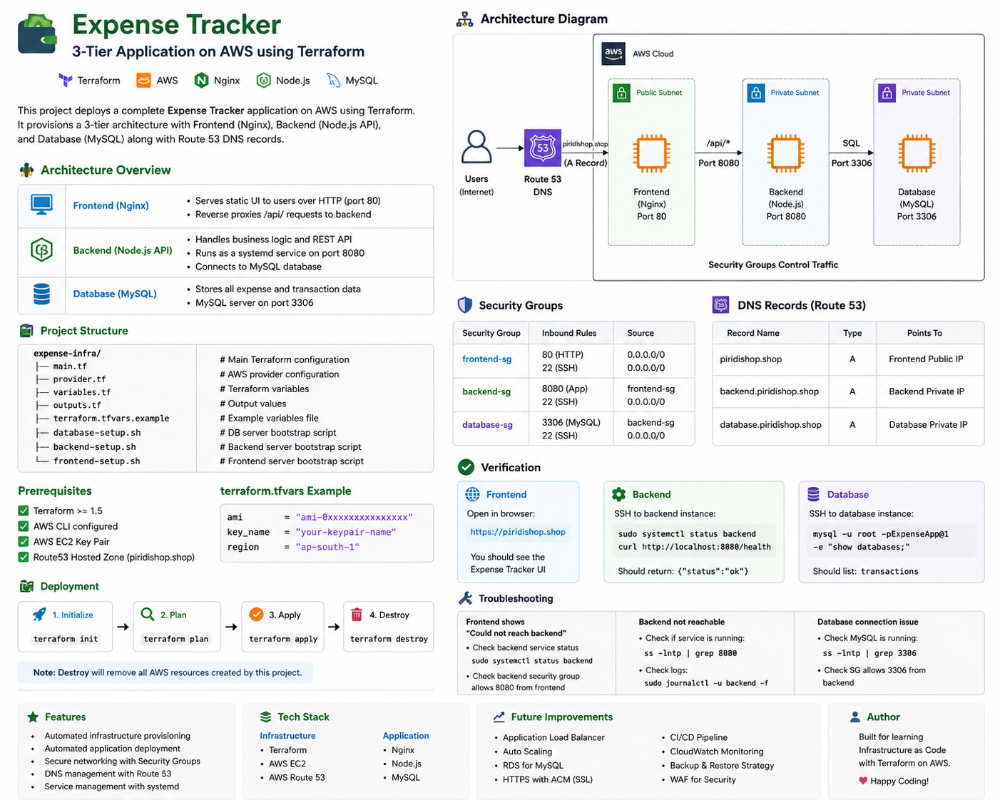
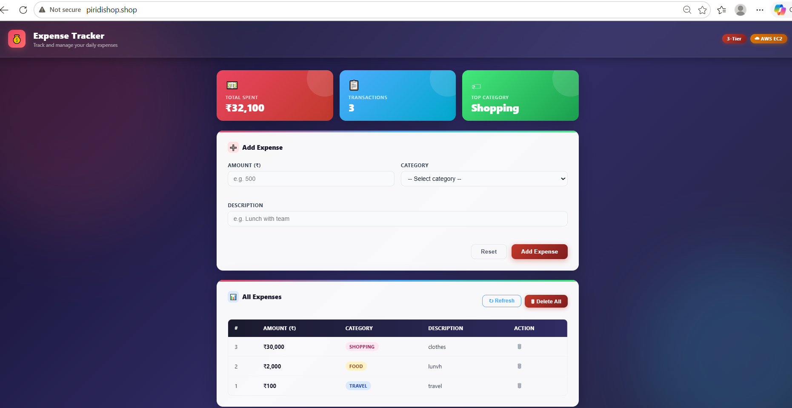

# Expense Tracker Infrastructure on AWS


A production-style 3-tier Expense Tracker deployment on AWS using Terraform.

---

## Architecture



### Flow

```text
User
  |
  v
Route53 DNS
  |
  v
Frontend (Nginx)
  |
  v
Backend (Node.js)
  |
  v
Database (MySQL)
```

---

## Project Structure

```text
expense-infra/
├── README.md
├── provider.tf
├── variables.tf
├── main.tf
├── outputs.tf
├── terraform.tfvars
├── docs/
│   ├── architecture.png
│   └── screenshots/
│       ├── app-home.png
│       └── backend-status.png
└── scripts/
    ├── frontend-setup.sh
    ├── backend-setup.sh
    └── database-setup.sh
```

---

## Features

- Infrastructure as Code using Terraform
- Automated EC2 provisioning
- Automated application deployment using user-data
- Route53 DNS integration
- Nginx reverse proxy
- Backend systemd service
- MySQL database bootstrap
- Fully reproducible deployment

---

## AWS Resources Created

- 3 EC2 Instances
- Security Groups
- Route53 DNS Records

### DNS Records

- `piridishop.shop`
- `backend.piridishop.shop`
- `database.piridishop.shop`

---

## Screenshots

### Application Home



---

## Prerequisites

Install locally:

- Terraform
- AWS CLI
- Git
- SSH Key Pair
- AWS Account
- Route53 Hosted Zone

---

## Terraform Variables

Create `terraform.tfvars`

```hcl
ami           = "ami-xxxxxxxx"
instance_type = "t3.micro"
key_name      = "your-key"
```

---

## Deployment

### Initialize

```bash
terraform init
```

### Validate

```bash
terraform validate
```

### Plan

```bash
terraform plan
```

### Apply

```bash
terraform apply
```

### Destroy

```bash
terraform destroy
```

---

## Verification

### Frontend

Open:

https://piridishop.shop

### Backend

SSH into backend server:

```bash
sudo systemctl status backend
curl http://localhost:8080/health
```

### Database

SSH into database server:

```bash
mysql -u root -pExpenseApp@1 -e "show databases;"
```

---

## Security Group Design

### Frontend SG

| Port | Source |
|---|---|
| 80 | Internet |
| 22 | Internet |

### Backend SG

| Port | Source |
|---|---|
| 8080 | Frontend SG |
| 22 | Internet |

### Database SG

| Port | Source |
|---|---|
| 3306 | Backend SG |
| 22 | Internet |

---

## Troubleshooting

### Backend not reachable

```bash
sudo systemctl status backend
sudo journalctl -u backend -f
```

### Port checks

```bash
ss -lntp | grep 8080
ss -lntp | grep 3306
```

### Cloud-init logs

```bash
sudo tail -100 /var/log/cloud-init-output.log
```

---

## Future Enhancements

- Application Load Balancer
- Auto Scaling Group
- RDS Migration
- SSL with ACM
- CI/CD Pipeline
- Monitoring with CloudWatch
- Backup automation

---

## Author

Built as a Terraform + AWS infrastructure automation project for deploying an Expense Tracker application.